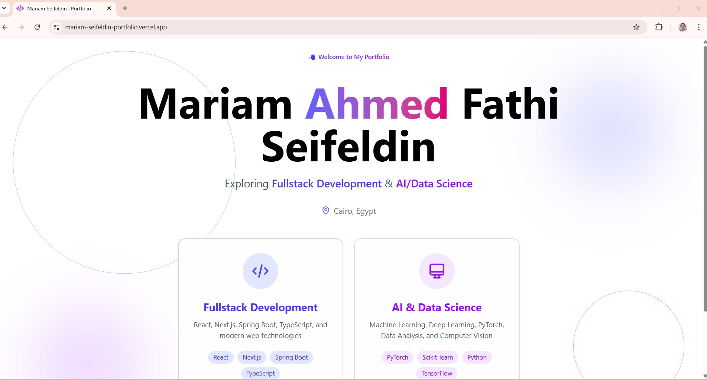

# Mariam Amro Ahmed Fathi Seifeldin | Portfolio

[](https://mariam-seifeldin-portfolio.vercel.app/)
[](https://nextjs.org/)
[](https://www.typescriptlang.org/)
[](https://tailwindcss.com/)
[](https://www.framer.com/motion/)

A modern, dual-path portfolio website showcasing work in **Fullstack Development** and **AI/Data Science**. Built with Next.js 15, TypeScript, and Tailwind CSS.

 <!-- Add a screenshot later -->

## ✨ Features

### 🏠 Landing Page

- Dual-path selection between Fullstack and AI portfolios
- Animated background elements matching the main portfolio aesthetic
- Interactive cards with hover effects and tech stack previews

### 💼 Two Distinct Portfolios

- **Fullstack Path**: React, Next.js, Spring Boot, TypeScript focus
- **AI Path**: Python, PyTorch, Machine Learning, Data Science focus
- Mode-specific color schemes (indigo for fullstack, purple for AI)

### 🧭 Smart Navigation

- Dynamic navbar that adapts to available content
- Shows Achievements only for fullstack, Certifications only for AI
- Custom 975px breakpoint for mobile hamburger menu
- Smooth scroll to sections with active state highlighting
- Home button and mode pill for easy navigation

### 🎨 Shared Component Library

- Fully reusable, type-safe components
- Theme-aware with next-themes (dark/light mode)
- Responsive design across all devices
- Accessible with keyboard navigation

### 📊 Global Features

- Mode switcher in hero section
- Scroll progress bar with mode-aware gradients
- Path-specific metadata for better SEO
- Custom favicon
- Smooth animations with Framer Motion

## 🛠️ Tech Stack

- **Framework**: [Next.js 16](https://nextjs.org/) (App Router)
- **Language**: [TypeScript](https://www.typescriptlang.org/)
- **Styling**: [Tailwind CSS v4](https://tailwindcss.com/)
- **Animations**: [Framer Motion](https://www.framer.com/motion/)
- **Icons**: [Lucide React](https://lucide.dev/)
- **Theme**: [next-themes](https://github.com/pacocoursey/next-themes)
- **Deployment**: [Vercel](https://vercel.com/)

## 📁 Project Structure

```
├── app/
│   ├── (landing)/
│   │   └── page.tsx              # Landing page
│   ├── fullstack/
│   │   ├── layout.tsx            # Fullstack metadata
│   │   └── page.tsx              # Fullstack portfolio
│   ├── ai/
│   │   ├── layout.tsx            # AI metadata
│   │   └── page.tsx              # AI portfolio
│   ├── layout.tsx                # Root layout
│   ├── providers.tsx             # Theme provider
│   └── globals.css                # Global styles
├── components/
│   ├── sections/                  # Page sections
│   │   ├── Hero.tsx
│   │   ├── About.tsx
│   │   ├── Projects.tsx
│   │   └── ...
│   ├── template/
│   │   └── PortfolioPage.tsx      # Shared portfolio template
│   └── ui/                         # Reusable UI components
│       ├── Navbar.tsx
│       ├── ModeSwitcher.tsx
│       ├── ThemeToggle.tsx
│       └── ...
├── lib/
│   ├── data/
│   │   ├── index.ts                # Data loader
│   │   ├── fullstack-data.ts       # Fullstack content
│   │   └── ai-data.ts               # AI content
│   ├── types.ts                     # TypeScript interfaces
│   └── navbar-config.ts             # Dynamic navbar config
└── public/
    ├── icons
    └── fullstack/                    # Fullstack project images
    └── ai/                           # AI project images
```

## 🚀 Getting Started

### Prerequisites

- Node.js 18+ 
- npm or yarn

### Installation

1. Clone the repository

```bash
git clone https://github.com/Mariam-Amro-2005/Portfolio.git
cd portfolio
```

2. Install dependencies

```bash
npm install
# or
yarn install
```

3. Run the development server

```bash
npm run dev
# or
yarn dev
```

4. Open [http://localhost:3000](http://localhost:3000) in your browser

### Build for Production

```bash
npm run build
npm start
```

## 🎯 Key Architecture Decisions

- **Data-Driven UI**: All content is stored in data files, making it easy to update and maintain
- **Dynamic Navbar**: Sections appear/disappear based on actual content (achievements vs certifications)
- **Shared Components**: All section components are reused across both portfolios
- **Mode-Aware Styling**: Color schemes change based on the selected path
- **Type Safety**: Full TypeScript coverage with strict interfaces

## 📱 Responsive Design

- **Desktop**: Full navbar with all sections visible (≥975px)
- **Mobile**: Hamburger menu with smooth dropdown
- **Custom breakpoint**: 975px for optimal viewing on various screen sizes

## 🌙 Dark Mode

Supports system preference and manual toggle with persistent storage. All components are styled for both light and dark themes.

## 🚢 Deployment

The site is deployed on Vercel with automatic deployments from the main branch.

[View Live Site](https://mariam-seifeldin-portfolio.vercel.app/)

## 📄 License

This project is open source and available under the [MIT License](./LICENSE.txt).

## 👩‍💻 Author

### Mariam Amro Ahmed Fathi Seifeldin

- LinkedIn: [mariam-seifeldin](https://www.linkedin.com/in/mariam-seifeldin/)
- GitHub: [@Mariam-Amro-2005](https://github.com/Mariam-Amro-2005)
- Email: [mariam.seifeldin.2005@gmail.com](mariam.seifeldin.2005@gmail.com)

## 🙏 Acknowledgments

- Icons by [Icons8](https://icons8.com/)
- Built with [Next.js](https://nextjs.org/)
- Deployed on [Vercel](https://vercel.com/)
